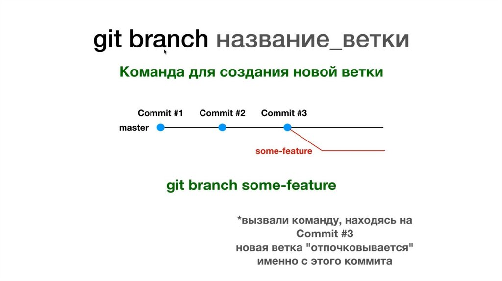

[< к содержанию](./readme.md)

# Ветвление

___

***git checkout*** *[наименование]* переключает на определенную ветку.

Совместить выполнение команды создания ветки и переключения на нее поможет - ***git checkout*** *[наименование]*.